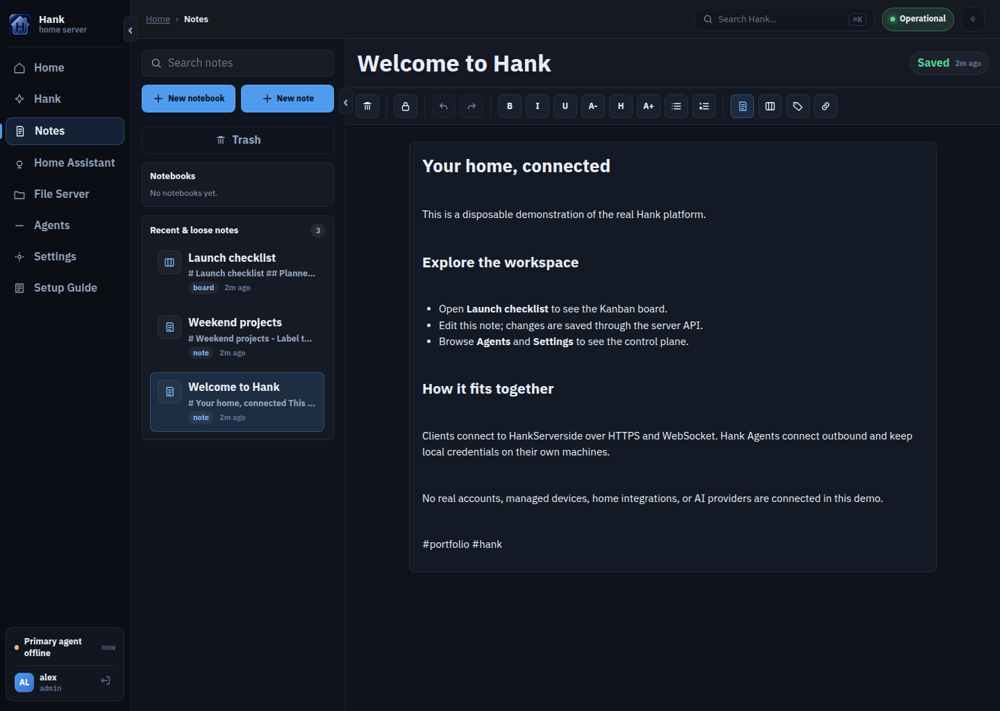
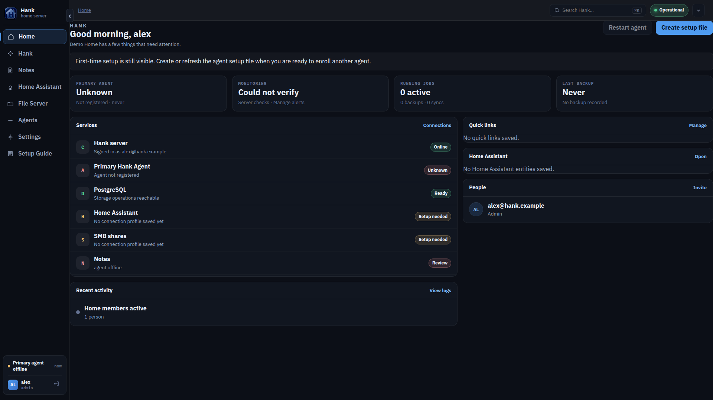
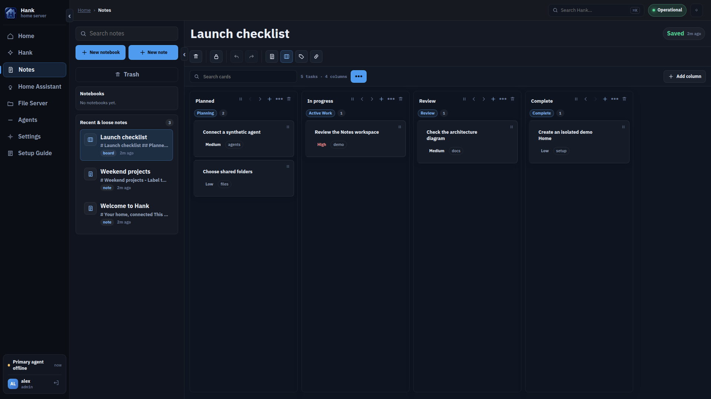
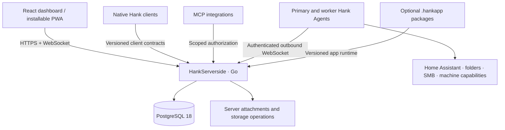

<div align="center">
  
  <h1>Hank</h1>
  <p>A self-hosted workspace that connects your notes, home services, and managed machines.</p>
  <p>
    
    
    
    
  </p>
  <p><a href="#try-the-local-demo">Try the demo</a> · <a href="#architecture">Architecture</a> · <a href="#the-hank-repositories">Clients and agents</a> · <a href="docs/README.md">Documentation</a></p>
</div>

**HankServerside is the canonical Hank platform.** It serves the React dashboard as
an installable Progressive Web App at `/dashboard`, owns authentication and
durable state, and routes work to Hank Agents that connect outbound from their
machines. Native clients and MCP integrations use the same HTTPS and WebSocket
contracts.

A deployment represents one Home with multiple users, one primary agent for
default home services, and optional worker agents for targeted machine tasks.



### See it in action

| Home dashboard | Kanban workspace |
| --- | --- |
|  |  |

These screenshots show the built application running against its real Go
server and a disposable PostgreSQL database. The account, notes, and tasks are
synthetic. No managed machines or external providers are connected;
the dashboard accurately shows the primary agent as offline.
[Capture details](docs/screenshots/README.md).

## What you can do

- **Write and organize:** personal and shared notes, notebooks, rich text,
  attachments, revisions, collaboration, and Kanban boards.
- **Work offline:** the PWA keeps a bounded Notes/Kanban workspace locally and
  queues changes for reconciliation, with explicit conflict and deletion review.
- **Connect home services:** route Home Assistant and file operations through
  an outbound-connected agent; browse configured local and SMB-backed sources.
- **Manage machines:** enroll agents, grant targeted capabilities, run durable
  jobs, inspect telemetry, and use the versioned remote-desktop control plane.
- **Extend the workspace:** scoped MCP tools, optional `.hankapp` packages, and
  configurable assistant integrations.
- **Operate the server:** embedded database migrations, authenticated metrics,
  audit events, backup/restore coordination, and deployment runbooks.

Some capabilities need an installed agent, platform-specific packaging, or a
configured provider. See [product scope](docs/product.md) and the feature docs
before treating a local web demo as a complete deployment.

## Try the local demo

Prerequisites: **Go 1.26.8+, Node.js 24+, Python 3, and a running Docker daemon**.
From a clean checkout:

```bash
git clone https://github.com/AaronCampbellit/HankServerside-public.git
cd HankServerside-public
npm ci --prefix web/dashboard
bash docs/demo/run.sh
```

Open **http://127.0.0.1:18080**. The launcher prints the path to a temporary
`login.txt`; read that file and sign in with the generated demo account. Open
**Notes → Welcome to Hank**, then **Launch checklist**. Edit a note, reload,
and verify the server retained it.

The launcher builds the dashboard and server, runs migrations in a new
PostgreSQL 18 container, and seeds three notes through authenticated APIs.
It binds both services to loopback, does not load deployment environment files,
and does not connect real agents or AI providers. **Ctrl+C removes the demo
database, process, and temporary credentials.** A conflicting web port can be
changed with `HANK_DEMO_PORT=18082 bash docs/demo/run.sh`.

This disposable demo is for local exploration. For a durable deployment,
follow [deployment and configuration](docs/deployment.md), which covers HTTPS,
secret generation, PostgreSQL, backups, and agent enrollment.

## Architecture



Agents keep local credentials and network access on their owning machines.
Public clients reach HankServerside over HTTPS/WebSocket; raw SMB, Home Assistant,
and filesystem protocols are not public client endpoints.

| Engineering concern | Implementation |
| --- | --- |
| Shared contracts | Versioned JSON envelopes, request IDs, structured errors, and compatibility schemas |
| Authorization | User, Home, role, permission, agent, and token scope checks; browser writes use CSRF tokens |
| Realtime coordination | WebSocket routing and events, reconnect handling, durable jobs, and explicit target selection |
| Persistence | PostgreSQL store, embedded versioned migrations, status and drift checks |
| Offline work | IndexedDB-backed Notes/Kanban state, queued edits, and visible reconciliation outcomes |
| Operations | Readiness checks, authenticated metrics, audit trails, backup/restore workflows, and release gates |

These describe implemented mechanisms, not an independent security
certification. See [architecture](docs/architecture.md), [API contracts](docs/api.md),
[security guidance](docs/security.md), and [PWA behavior](docs/pwa.md).

## The Hank repositories

| Repository | Responsibility |
| --- | --- |
| **HankServerside** — this repository | Canonical backend, dashboard/PWA, protocols, persistence, built-in agent, and app runtime |
| [Hank](https://github.com/AaronCampbellit/Hank-public) | Native SwiftUI client for iPhone and iPad |
| HankAgent-Linux (private supporting component) | Standalone Linux agent and fleet tooling |
| HankAgent-Windows (private supporting component) | Windows managed-machine agent |
| HankAgent-Mac (private supporting component) | Native macOS agent and local capability adapter |

The local web demo runs entirely from this repository; the separate agent
repositories remain private. This repository includes its own built-in agent.

Each client or agent owns its platform-specific interface and packaging.
HankServerside owns the established platform contracts.

## Develop and verify

```bash
go test ./...
npm --prefix web/dashboard ci
make frontend-test
make frontend-build
go build ./...
```

Use `HANK_TEST_DATABASE_URL` with a **disposable database** to exercise
PostgreSQL-backed tests. Tests that skip without it do not count as database
validation. Provider evaluations, physical remote-desktop acceptance,
packaging/signing, backup/restore proof, and a shared demo deployment have their
own gates in [RELEASE.md](RELEASE.md) and
[demo validation](docs/demo-validation.md).

| Path | Start here |
| --- | --- |
| `cmd/` | Server, agent, and database-operations entry points |
| `internal/cloud` | HTTP/WebSocket APIs, auth, relay, MCP, assistant, and app runtime |
| `internal/agent` and `internal/protocol` | Outbound agent lifecycle and wire contracts |
| `internal/store` and `internal/migrations` | Persistence and versioned schema workflow |
| `web/dashboard` | React/Vite/TypeScript dashboard and PWA |
| `scripts`, `tools`, `ops` | Setup, validation, releases, and monitoring |

The [documentation catalog](docs/README.md) links current product, feature,
contract, and operator guidance. Existing deployments must follow the
[naming migration](docs/naming-migration.md) before upgrading from retired
technical identifiers. Repository contribution and ownership rules live in
[AGENTS.md](AGENTS.md).

## Distribution materials

Use `make distribution` to build Go binaries with their dependency notices and
MPL-covered source in `dist/`. Dashboard builds carry a notice asset; the
standalone MCP Kanban HTML carries its notices internally. Go application
containers preserve the same source-access and license materials under `/app/`.
The [SMB dependency patch](third_party/go-smb2/HANK-FORK.md) keeps the pinned
transport/security implementation while excluding unused parsed-descriptor
APIs and their former LGPL dependency. Container/base-image licensing and signed
release acceptance remain separate from this source portfolio review.

## License

Aaron Campbell reserves all rights to the original material he owns; see [LICENSE](LICENSE). Third-party code, dependencies, and assets retain their own licenses and notices. See [third-party notices](THIRD_PARTY_NOTICES.md) for reviewed components and outstanding publication or distribution requirements.
